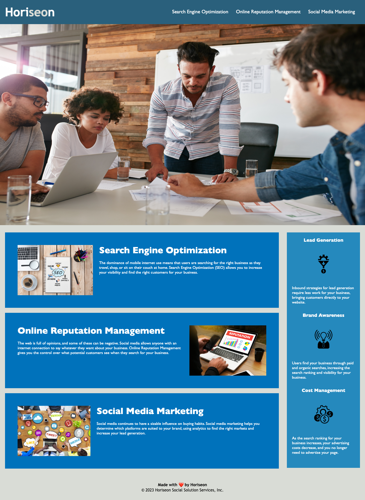

## Name 

Web Accessibility Refactoring Project

## Description

The goal of this project is to refactor the code of an existing website so that it follows web accessibility standards. 

Web accessibility ensures that people with disabilities can access a website using assistive technologies like video captions, screen readers, and braille keyboards. Accessibility is good for business—for one thing, accessible sites rank higher in search engines like Google. It also helps companies avoid litigation, which might arise if people with disabilities can't access a website.

## Installation 

N/A

## Usage 
Use the following link to access the deployed webpage: 
https://dymoy.github.io/accessibility-challenge/

The source code is found in the root directory of the main branch. 

## Visuals 

## Credits

Starter code was provided by the Univeristy of Texas at Austin.

## License 

Please refer to the license in the repo.
